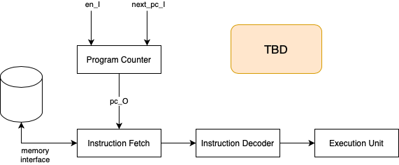

# Jemos Processor Core

Just a very simple processor I'm building for learning purposes, based on RISC-V 32bit.

# Architecture

# Testing

In this section I leave some information on how to test the core modules.

## Test Program Counter

To test the program counter, run the following command. Assuming `gmake` is gnumake.

	$ gmake test V=test/jpc_pc_tb.v

This will generate the test binary and execute it. The output should show the current
time and signal variations.

To see the same information in a waveform, we can use the `wave` target of the Makefile.

	$ gmake wave V=test/jpc_pc_tb.v 

# Hardware

To test this processor I've used was a small Spartan 7 Series (XC7S15), with 12.8k logic cells, 2000 slics, 16k CLB Flip-Flops, 10 blocks of RAM/FIFO with ECC, with 36Kb each.

