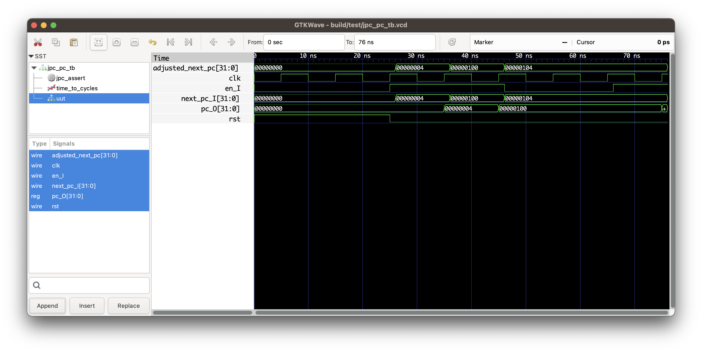

# Jemos Processor Core

Just a very simple processor I'm building for learning purposes, based on RISC-V 32bit.

# Architecture

# Testing

In this section I leave some information on how to test the core modules.

Pre-requisites:
 * Icarus Verilog
 * Gtkwave if you'd like to see waveforms
 * GNU Make

## Test Program Counter

To run all testbenches, use the command:

	$ make test

This command will look for all testbench files under `test/` folder (files with the pattern `*_tb.v`)
compile and run using the HDL simulation tool.

If you'd like to run a specific testbench file, you can use the following command format:

	$ make test TB_FILES=test/<TEST_BENCHFILE> DEBUG=1

Change the `TESTBENCH_FILE` accordingly. The `DEBUG=1` is needed if you'd like to see the results of the
testbench execution in the output. Alternatively, you can always see that output in `run.log` file.

Each test in the testbench should be uniquely identified. For example, the following is the test
result line for `PC001` ("Program Counter 001"):

	[TEST:PC001 PASSED]: PC did not reset correctly (pc=0x00000000).

If all tests pass, the Makefile output will show a "All testbenches PASSED." message.

To run the program counter testbench, use the following command.

	$ make test TB_FILES=test/jpc_pc_tb.v DEBUG=1
	Running tests: test/jpc_pc_tb.v
	No memory file provided. Using default values.
	VCD info: dumpfile build/test//jpc_pc_tb.vcd opened for output.
	Time: 0 | Reset: 1 | PC Enable: 0 | Next PC: 00000000 | Current PC: 00000000
	Time: 25000 | Reset: 0 | PC Enable: 1 | Next PC: 00000000 | Current PC: 00000000
	[TEST:PC001 PASSED]: PC did not reset correctly (pc=0x00000000).
	Time: 26000 | Reset: 0 | PC Enable: 1 | Next PC: 00000004 | Current PC: 00000000
	Time: 35000 | Reset: 0 | PC Enable: 1 | Next PC: 00000004 | Current PC: 00000004
	[TEST:PC002 PASSED]: PC increment failed! Expected 4, got 4
	Time: 36000 | Reset: 0 | PC Enable: 1 | Next PC: 00000100 | Current PC: 00000004
	Time: 45000 | Reset: 0 | PC Enable: 1 | Next PC: 00000100 | Current PC: 00000100
	[TEST:PC003 PASSED]: PC branch failed! Expected 32'h100, got 100
	Time: 46000 | Reset: 0 | PC Enable: 0 | Next PC: 00000104 | Current PC: 00000100
	[TEST:PC004 PASSED]: PC stall failed! Expected 32'h100, got 100
	Time: 66000 | Reset: 0 | PC Enable: 1 | Next PC: 00000104 | Current PC: 00000100
	Time: 75000 | Reset: 0 | PC Enable: 1 | Next PC: 00000104 | Current PC: 00000104
	[TEST:PC005 PASSED]: PC resume failed! Expected 32'h104, got 104
	jpc_pc: All tests completed
	test//jpc_pc_tb.v:90: $finish called at 76000 (1ps)
	All testbenches PASSED.

When the testbench executes, it may save waveforms. To see them, you can use the following
make command:

	$ make wave V=test/jpc_pc_tb.v 

The output is something like:

# Hardware

To test this processor I've used was a small Spartan 7 Series (XC7S15), with 12.8k logic cells, 2000 slics, 16k CLB Flip-Flops, 10 blocks of RAM/FIFO with ECC, with 36Kb each.

