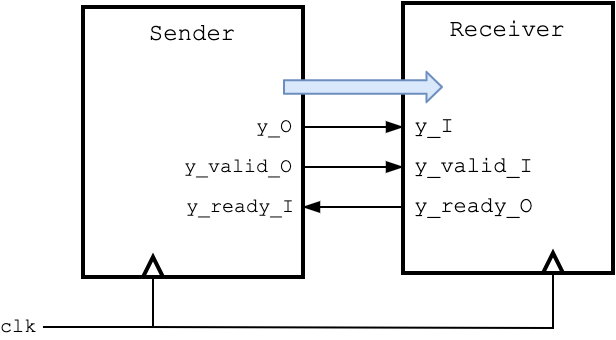
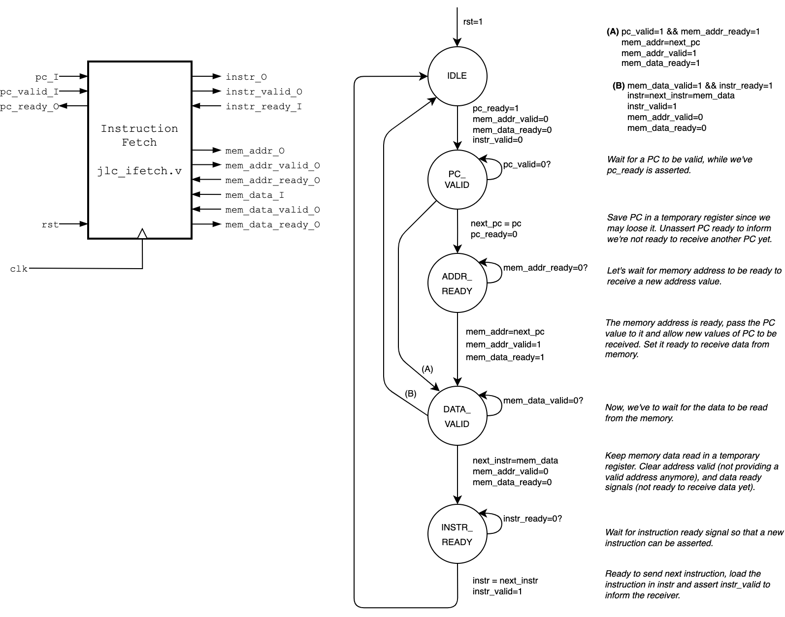
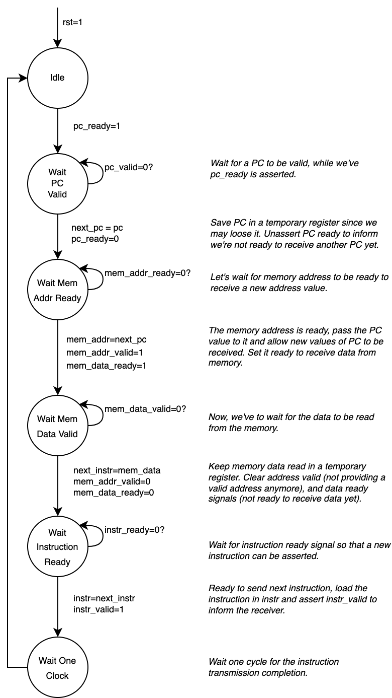
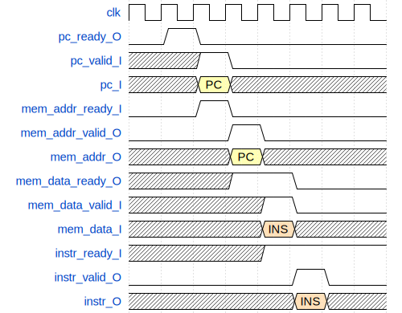
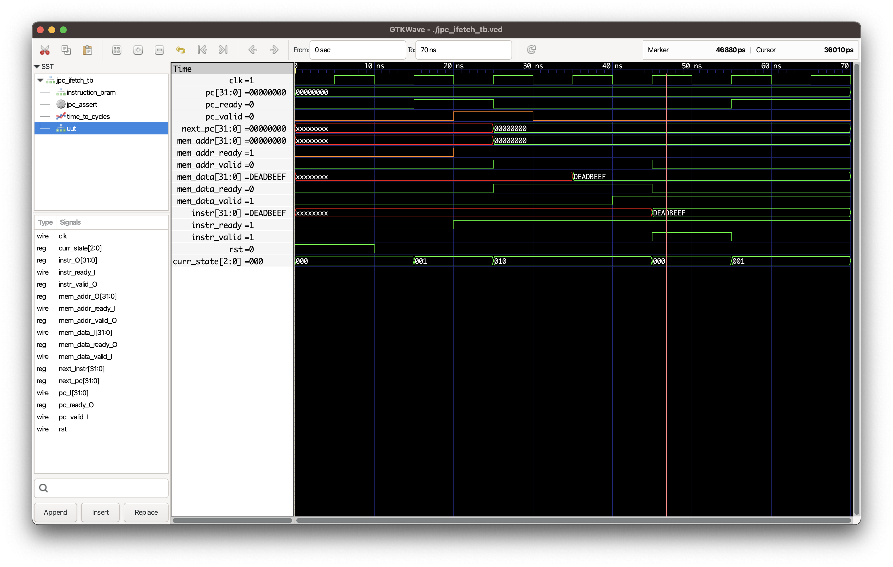
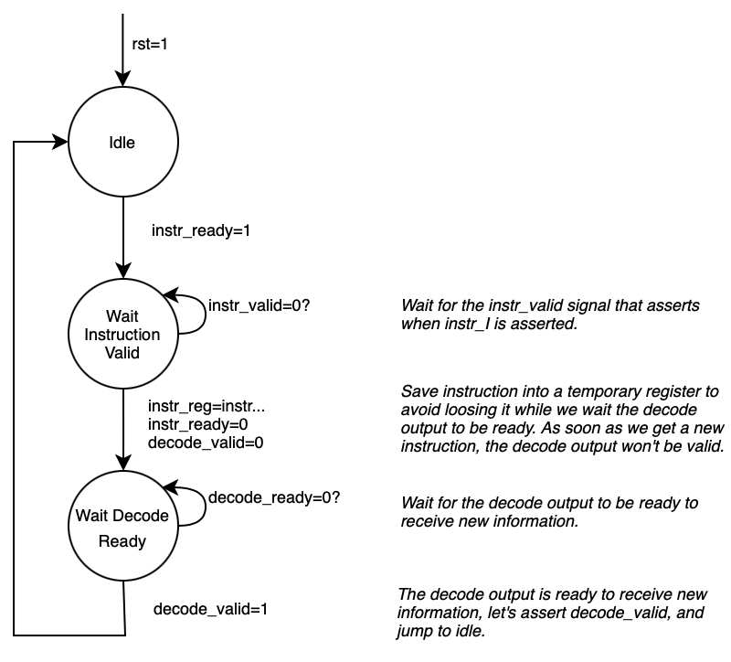

## Architecture

The JPC has the architecture shown in the following diagram.

## Basic Handshake Usage

In a performance-focused design, the handshakes are not convenient because they make operations take additional clock cycles. However, this is an educational processor I did just for my learning experience. I could not know upfront if the memory block would be able to provide the data at the same clock of the address capture, like a tightly coupled memory. I thought that using handshakes would make it easier to support different implementation strategies for the blocks and pipeline stages.

As shown in the Figure X, I’m using a basic handshake mechanism (see Figure X) with _ready_ and _valid_ signals, inspired by ARM’s AMBA AXI. The _receiver_ drives _ready_ to indicate it can accept new data, and the _sender_ drives valid to indicate that data on the bus is valid. The _receiver_ captures the data on any clock cycle in which both _ready_ and _valid_ are asserted. The following two scenarios are valid:
1. The _ready_ is asserted before the _valid_, and when _valid_ is asserted, the data transfer occurs;
2. The _ready_ is asserted in the same clock cycle of _valid_ and the data transfer occurs.

## Instruction Fetch

The instruction fetch will use the current Program Counter (PC) value and fetch the instruction from the memory interface. 

We've the following groups of signals:

* The program counter input, taken from the program counter block which may have some overriding logic, for jumps, exceptions and similar cases;
* The instruction output that should contain the instruction read from the memory and ready to be consumed by the subsequent block (the Instruction Decoder);
* The memory interface with an address bus and a data bus;
* The next program counter value, which will be the current program counter plus the size of an instruction opcode.

To initialize the instruction fetch the reset (`rst`) should be asserted for one clock cycle. This will clear all output valid signals.

The following state diagram (Figure X) describes the instruction fetch internal flow.

The waveform for a full instruction fetch assuming the memory block takes the minimum possible time from address capture to instruction output availability.

<!-- Wavedrom source (https://wavedrom.com/editor.html)
{
    "signal": [
        { "name": "clk",              "wave": "p......." },
        { "name": "pc_valid_I",       "wave": "x.10...." },
        { "name": "pc_I",             "wave": "x.3x....", "data": [ "PC" ] },
        { "name": "pc_ready_O",       "wave": "010....." },
        { "name": "mem_addr_ready_I", "wave": "0.10...." },
        { "name": "mem_addr_valid_O", "wave": "0..10..." },
        { "name": "mem_addr_O",       "wave": "x..3x...", "data": [ "PC" ] },
        
        { "name": "mem_data_ready_O", "wave": "x..1.0.." },
        { "name": "mem_data_valid_I", "wave": "x...10.." },
        { "name": "mem_data_I",       "wave": "x...3x..", "data": [ "INS" ] },

        { "name": "instr_ready_I", "wave": "x...1..." },
        { "name": "instr_valid_O", "wave": "0....10." },
        { "name": "instr_O",       "wave": "x....3x.", "data": [ "INS" ] }
        
    ]
}

-->

(Figure 3)

After reset, the instruction fetch enters an idle state. From that state, it asserts `pc_ready_O` to indicate external module that it is ready to receive a new program counter value, and transitions to the next state (_Wait PC Valid_).

In _Wait PC Valid_ it waits for `pc_valid_I` to be asserted which indicates when there is a valid program counter value at `pc_I`, ready to be captured by the instruction fetch.

Once `pc_valid_I` is asserted, the `pc_I` is captured and saved in an internal register, and `pc_ready_O` is unasserted to indicate it's no longer accepting new program counter values. It transitions to the next state _Wait Mem Addr Ready_.

In _Wait Mem Addr Ready_, it waits for the memory block to be ready to accept a new address. When `mem_addr_ready_I` is asserted it will load `mem_addr_O` with `next_pc` value, assert `mem_addr_valid_O` to inform there is a valid address, and assert `mem_data_ready` to inform it's ready to receive new data value. It transitions to _Wait Mem Data Valid_ state.

In _Wait Mem Data Valid_ state it waits for the memory to send new data. When `mem_data_valid_I` is asserted it means we've valid data in `mem_data_I`. The data is stored in an internal register and `mem_addr_valid_O` is unasserted to inform we're no longer providing a valid address to the memory block. The `mem_data_ready_O` is also asserted to inform it's no longer accepting new data values. Then transitions to next state _Wait Instruction Ready_ where the instruction fetch waits for the external block to be ready to receive a new instruction.

In _Wait Instruction Ready_ it waits for `instr_ready_I` signal to be asserted which means the external block (i.e., instruction decoder) is ready to accept a new instruction. Once it's asserted, it will load the output `instr_O` with the new instruction, and `instr_valid_O` is asserted to indicate the external block that the `instr_O` has a valid value.

Then it waits a clock cycle and transitions to the idle state again.

### Optimizing Instruction Fetch

If we look at the waveform in Figure X, we see it takes 3 clock cycles from capturing a valid PC and capturing the instruction at output. Can we make this instruction fetch faster?

If the `pc_I` and `pc_valid_I` are directly connected to the `mem_addr_O` and `mem_addr_valid_O` signals respectively, we could spare one clock cycle because the capture of `pc_valid_I` would match the capture of `mem_addr_valid_O`, assuming `mem_addr_ready_I` is asserted. It would require adding combinational logic that is active between clock cycles.

    assign mem_addr_valid_O = pc_valid_I && state_wait_pc && mem_addr_ready_I;
    assign mem_addr_O = pc_I;

The same strategy could be employed between the memory address and memory data, and between memory data and instruction ready.

### Test and Simulation

To run some basic tests in the instruction fetch, please use the following commands. It assumes that you have icarus verilog installed in your environment.

    $ iverilog -g2012 -I src src/jpc_config.v src/jpc_pc.v \
    src/jpc_32bram.v src/jpc_ifetch.v test/jpc_ifetch_tb.v
    $ ./a.out 
    No memory file provided. Using default values.
    VCD info: dumpfile jpc_ifetch_tb.vcd opened for output.
    0ns | PC: 00000000 (v0 r0) | INSTR: xxxxxxxx (v0 r0)
    15ns | PC: 00000000 (v0 r1) | INSTR: xxxxxxxx (v0 r0)
    [Test 1 @ 20ns] PASSED: Reset did not clear instr_valid (instr_valid=0)
    [Test 2 @ 20ns] PASSED: Trying to read memory after reset (mem_addr_valid=0, mem_data_ready=0).
    [Test 3 @ 20ns] PASSED: Not ready to receive PC (pc_ready=1).
    20ns | PC: 00000000 (v1 r1) | INSTR: xxxxxxxx (v0 r1)
    25ns | PC: 00000000 (v1 r0) | INSTR: xxxxxxxx (v0 r1)
    [Test 4 @ 30ns] PASSED: Not loading memory address (mem_addr_valid=1)
    30ns | PC: 00000000 (v0 r0) | INSTR: xxxxxxxx (v0 r1)
    45ns | PC: 00000000 (v0 r0) | INSTR: deadbeef (v1 r1)
    [Test 5 @ 50ns] PASSED: Not fetched the instruction (instr_valid=1)
    [Test 6 @ 50ns] PASSED: Incorrect instruction fetched (instr=deadbeef)
    55ns | PC: 00000000 (v0 r1) | INSTR: deadbeef (v0 r1)
    jpc_ifetch: All tests completed
    test/jpc_ifetch_tb.v:158: $finish called at 70000 (1ps)

The waveform can be seen with gtkwave. An example is shown below.

## Instruction Decoder

The instruction decoder is a sequential block that decomposes the instruction bits into the different fields that can be more easily processed by the execution unit. I chosen to do it sequential to support handshake-based inputs and outputs.

The following diagram illustrates the inputs and outputs of the instruction decoder block.

With the ready and valid signals, there is control flow of the information and we can easily stall the information transfer.

## Instruction Unit

TBD

## Arithmetic Logic Unit (ALU)

TBD

## Register File

TBD

## External Memory

TBD

## Peripherals

TBD

# References

